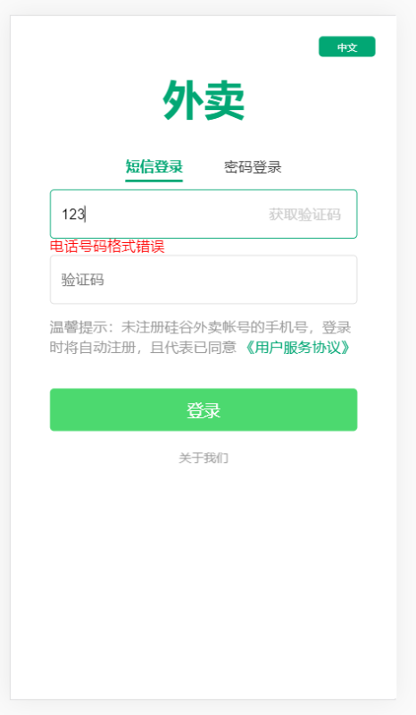
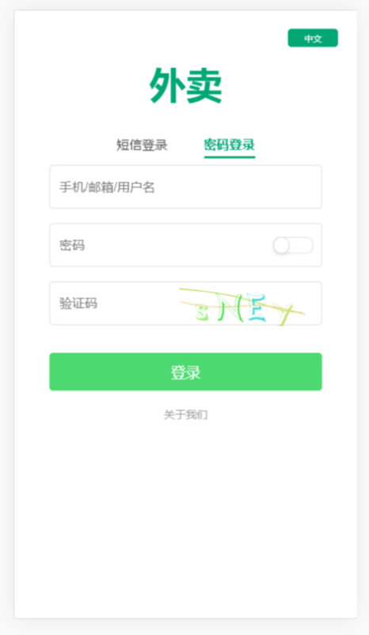
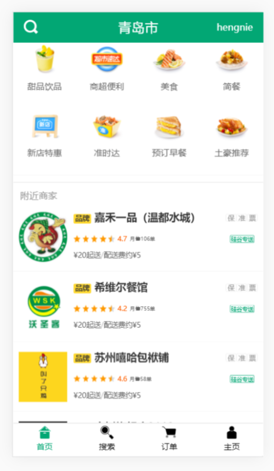
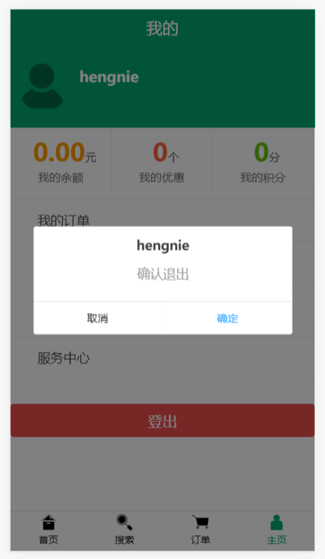
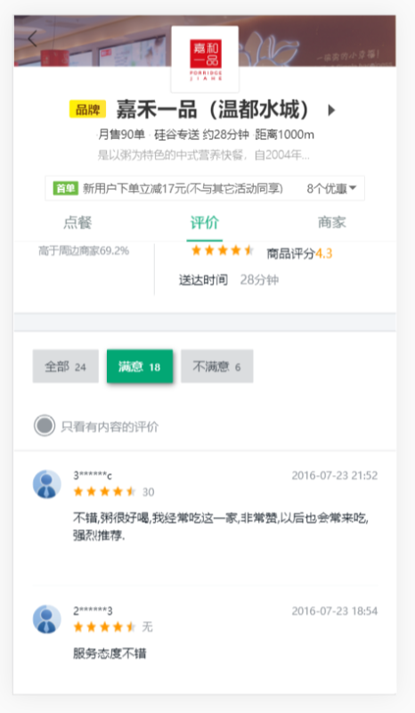
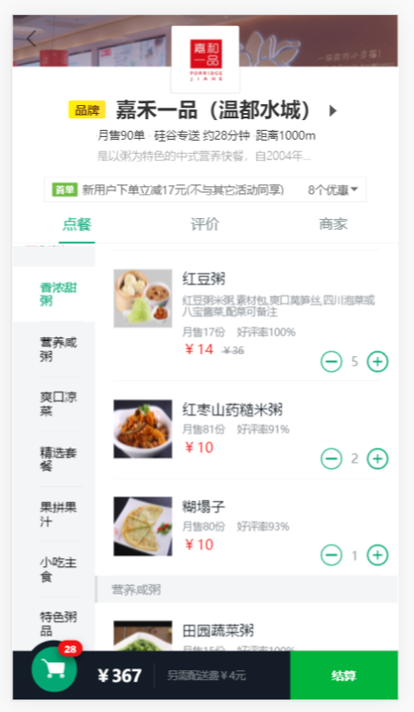
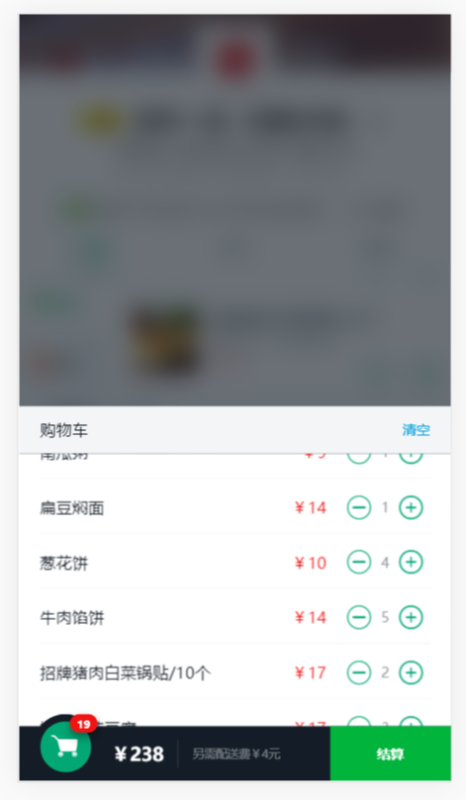
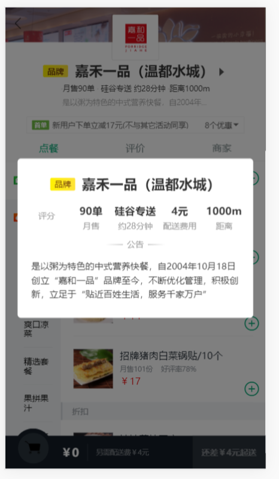

## 介绍

#### 2021/5/23更新：将使用vue3、vite、typescript、vant重写

> 此 demo 利用 Vue,利用 Vue-Router + Vue-Cli 工程化构建外卖信息展示单页面应用，使用 vuex 管理主要的商家数据,利用 axios 的拦截器设置请求参数,利用 mock.js 模拟后台接口，使用 mint-ui 完成部分组件功能，并用 fastclick 和 postcss-px2rem 解决移动端适配问题和 300ms 延迟问题

#### 登陆页

-   利用`localStorage`实现登陆用户信息保存和自动登陆检查功能
-   使用 Vue I18n 练习部分国际化
-   使用容联云的免费短信验证码服务进行验证码验证
-   利用正则进行电话号码格式验证

 

#### 一级路由页面(商家列表页，个人信息页)

 

#### 商家页

-   利用 better-scroll 进行滑动效果设置并修复了商品顶端上滑和商品低端下滑时左侧分类列表不会显示当前分类的 bug
-   利用 watch 监视商品信息的变化以修复刷新和路由切换导致无法滚动的 bug
-   自定义了购物车添加按钮组件以进行多次复用，并进行了函数节流以限制添加速度

## 问题记录

1.  商家页面第一次进入无法滚动商品和分类
    **分析**：`src/pages/Shop/ShopGoods.vue `必须等页面的数据`shopMsg`加载完成`new BScroll`才能让 betterScroll 正确管理完整数据，所以应用 watch 监视 shopMsg，有数据后再`new``
    new issue： shopCar 修改源码后仍需刷新才能滚动，猜测是\$nextTick 的问题
     

    使用 BetterScroll 刚`npm run serve`时无法进行滑动，需要修改 BetterScroll 的源码，
    修改`BetterSC/shared-utils/src/dom.ts` 中的常量 hasTouch 为 true,
    这样就可以在初始化时对参数进行设置,把一切掌握在自己手中

    **使用方法**如下:
    new BScroll 时,在参数 options 中加入

         mouseWheel: true,   //开启鼠标滚轮
         disableMouse: false,   //启用鼠标拖动
         disableTouch: false    //启用手指触摸

    参考博客：https://www.cnblogs.com/mldonkey/p/11421577.html
     

2.  vuex 的`commit`不要随便去掉 state 参数，以防传入其他参数被当成 state
     

3.  父级组件可以直接调用子级组件的方法，借助`ref`
     

4.  注意过渡类名在过渡结束后都会删除，用动画 animation 才不会删除(记录路径：`src/components/shopCar/shopCar.vue`的`style`)
     

5.  注意`$nextTick`的使用，特别是使用`better-scroll`时
     

6.  尝试使用 history 模式。。。(nginx 配置报错，待解)

7. 
